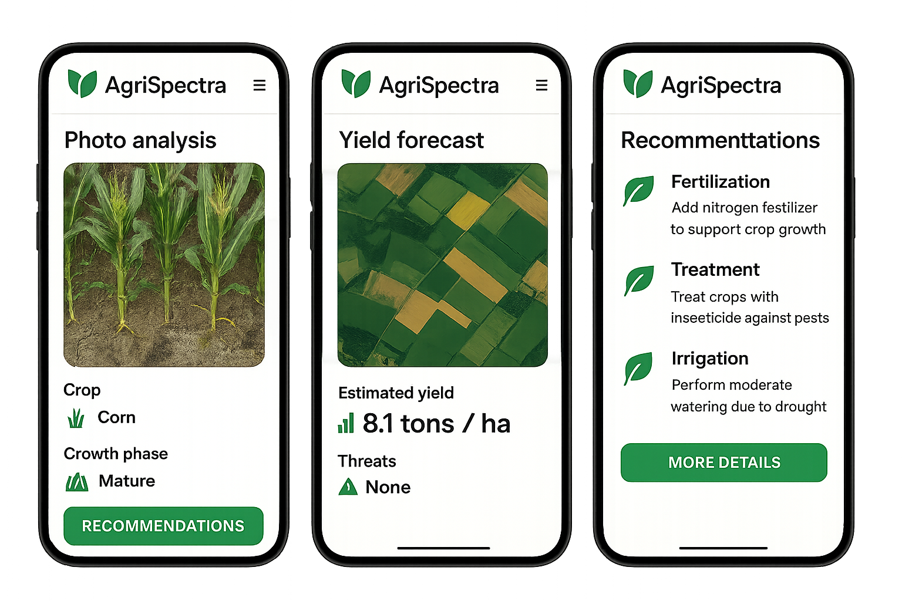

# AgriSpectra: сервис для диагностики сельскохозяйственных культур и прогноза урожайности

## Шаг 1: Описание продукта

Интеллектуальное мобильное и веб-приложение, которое позволяет по фотографии с телефона или дрона определить культуру, фазу роста и наличие/тип повреждений, а затем выдать рекомендации по уходу, а также использует спутниковые данные для прогнозирования урожайности и потенциальных угроз.

Продукт рассчитан на глобальный рынок, но с фокусом на Российскую Федерацию в начальных стадиях.

- **Коммерческая цель**: Снижение потерь урожая и повышение эффективности агробизнеса за счёт мобильной диагностики и спутниковой аналитики.
- **Технологическая цель**: Интеграция компьютерного зрения (анализ фото) и спутниковых данных для получения прогнозов и выявления угроз на разных масштабах (от листа до поля).
- **Решаемые проблемы**:
  - Потери урожая из-за болезней/вредителей  
  - Отсутствие прогнозов урожайности  
  - Отсутствие адаптации к климатическим рискам  

## Шаг 2: Целевой пользователь

* Мелкие фермеры и КФХ (крестьянско-фермерские хозяйства)
  Описание: Частные фермеры, часто семейные хозяйства, обрабатывающие от нескольких до сотен гектаров. В России в эту категорию входят КФХ, а также активные владельцы ЛПХ.

* Крупные агропредприятия и агрохолдинги
  Описание: Организации, обрабатывающие от 1000 до 100000+ гектаров. В России контролируют до 80% сельхозугодий.
  * Агрокомплекс им. Н. И. Ткачёва (1 126 тыс. га)
  * Группа компаний «Продимекс» (900 тыс. га)
  * ГК «Русагро» (689 тыс. га)

## Шаг 3: Ценность продукта

* Для мелких фермеров и КФК:
  * Снижение потерь урожая за счёт ранней диагностики;
  * Повышение урожайности благодаря точным рекомендациям;
  * Экономия на агрохимии и ресурсах (вода, труд);
  * Уверенность в действиях — доступ к экспертной информации в любое время;
  * Возможность планировать и прогнозировать результат.

  Как измеряется ценность:
  * % снижение потерь урожая (до/после внедрения);
  * Повышение урожайности (ц/га или тонн/га);
  * Снижение затрат на СЗР и удобрения (% от бюджета);
  * Регулярность использования приложения и уровень удовлетворённости;
  * Число рекомендаций, которым последовали, и их результат.

* Для агропредприятий и холдингов:
  * Быстрая диагностика проблем на больших площадях;
  * Централизованный контроль за состоянием всех полей;
  * Снижение затрат на мониторинг (меньше выездов, больше автоматизации);
  * Прогноз урожайности — возможность точно планировать логистику, сбыт, хранение.

  Как измеряется ценность:
  * Снижение времени реакции на проблему (часы → минуты);
  * Точность прогноза урожайности (например, ±5% по сравнению с фактом);
  * Рост урожайности или снижение затрат на 1 га;
  * Экономия рабочего времени агрономов (часов/неделю);
  * ROI: сколько сэкономлено или дополнительно заработано на 1 рубль, вложенный в сервис.

## Шаг 4: Взаимодействие пользователя с продуктом

* Мелкие фермеры и КФХ
  * Мобильное приложение или веб-сайт, версия Light с возможностью расширения до Pro. 
    Ключевые возможности:
    * Загрузка фото культуры (например, кукурузы или зелёного горошка);
    * Получение диагностики: тип культуры, фаза роста, наличие/тип повреждения;
    * Получение рекомендаций по действиям (обработка, удобрение, полив и пр.);
    * Сохранение результатов или отправка отчёта по e-mail;
    * Веб-сайт или мобильное приложение отслеживает геолокацию и предлагает спутниковый мониторинг полей;
    * Возможность добавления и отслеживания конкретных полей;
    * Прогноз урожайности по каждому полю;
    * Уведомления о рисках (засуха, вспышка болезней по спутниковым данным);
    * Подробная аналитика по сезонам;
    * Сохранение выполненных действий по каждому полю и напоминания (например, о поливе).

* Крупные агропредприятия и агрохолдинги
  * Веб-сайт и мобильное приложение, версия Pro.
    Ключевые возможности, дополнительно к имеющимся у версии Light:
    * Авторизация по ролям (агроном, руководитель, механизатор);   
    * Создание профиля организации;
    * Выгрузка отчётов в CSV или API для внутренней системы;
    * Визуализация в виде таблиц, графиков, тепловых карт проблемных зон
    * Панель мониторинга по всем полям (здоровье растений, индекс NDVI, прогноз урожайности);
    * Настраиваемые отчёты и уведомления (например, в Telegram, почту);
    * Визуализация в виде таблиц, графиков, тепловых карт проблемных зон.

## Шаг 5: Привлечение пользователей

* Мелкие фермеры и КФХ:
  Каналы привлечения:
   * Социальные сети (YouTube, Telegram, ВКонтакте) с агрономическим контентом;
   * Партнёрства с кооперативами, магазинами семян и СЗР (например, "Биоцентр", «ФосАгро»);
   * Демонстрация на региональных выставках и агроярмарках;
   * Онлайн-реклама по геотаргетингу (области с высокой долей КФХ);
   * Органический трафик через SEO (запросы по болезням растений, уходу за культурами);
   * Рассылки через ассоциации фермеров.

* Крупные агропредприятия и агрохолдинги:
  Каналы привлечения:
   * Прямые продажи через отраслевые конференции (ЮгАгро, Золотая осень и пр.);
   * Партнёрства с консалтинговыми компаниями (Агроаналитика, Digital Agro);
   * B2B outreach через LinkedIn и деловые мероприятия;
   * Участие в акселераторах и пилотных программах крупных игроков (Русагро, ЭкоНива);
   * Публикации кейсов и аналитики в отраслевых медиа (Агроинвестор, AgroXXI);
   * Выставки и мероприятия по цифровизации сельского хозяйства.

##  Шаг 6: Бизнес-модель

* Мелкие фермеры и КФХ:
  **freemium + подписка**
  * Freemium: базовая диагностика (1-2 фото в неделю) бесплатно.
  * Подписка: доступ к неограниченному количеству загрузок, сохранённой истории, спутниковому мониторингу, рекомендациям по удобрениям и прогнозам урожайности.
  * Цены: от 199 до 499 ₽ в месяц в зависимости от объёма использования и площади.
  * Дополнительно: микроплатежи за расширенные функции (PDF-отчёты, агроном-консультант, экспорт в Excel).
  Причины выбора:
  * Сегмент чувствителен к цене, но готов платить за реальную пользу;
  * Простая модель привлечения через бесплатный доступ;
  * Постепенное вовлечение в платный сценарий при росте доверия к ИИ.

* Крупные агропредприятия и агрохолдинги:
  **Лицензирование + кастомизация + сервисная поддержка**
  * Лицензия по числу гектаров или по числу полей в системе. Пример: от 50 руб./га/год.
  * Пакеты поддержки: базовая (e-mail, веб) и расширенная (персональный менеджер, API-интеграция, обучение сотрудников).
  * Дополнительные модули: API-интеграция, кастомизация интерфейса под нужды предприятия, белая маркировка.
  * Пилотные внедрения: 1-3 месяца бесплатно с демонстрацией эффекта.
  Причины выбора:
  * Клиенты в этом сегменте предпочитают прогнозируемые, масштабируемые модели;
  * Им важна интеграция с существующими системами, отчётность, гарантия SLA;
  * Возможность гибкой адаптации под бизнес-процессы клиента.

## Шаг 7: Описание продуктового позиционирования

* Мелкие фермеры и КФХ:
Мы, агротехнологический стартап AgriSpectra, помогаем малым фермерам и владельцам КФХ в ситуации, когда нет возможности вызвать агронома или быстро понять, что происходит с посевами, решать проблему потерь урожая из-за болезней, вредителей и ошибок в уходе с помощью технологии диагностики по фотографии и ИИ-рекомендаций в мобильном и веб-приложении и получать ценность в виде простых, понятных советов, которые помогают сохранить урожай, сэкономить ресурсы и быть уверенным в своём решении.

* Крупные агропредприятия и агрохолдинги:
Мы, AgriSpectra - разработчик ИИ-решений для агробизнеса, помогаем агрохолдингам и крупным производителям в ситуации, когда требуется масштабный контроль посевов и принятие оперативных решений по полям площадью от тысяч гектаров, решать проблему отсутствия прозрачности, задержек в реакции на риски и неэффективного распределения ресурсов с помощью технологии спутникового мониторинга, прогнозов урожайности и фотоаналитики на базе машинного обучения и получать ценность в виде экономии затрат на мониторинг, роста управляемости и повышения урожайности без расширения штата.
